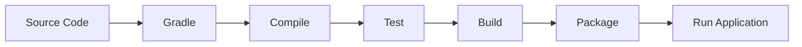

# ☕ CodeAlpha Task Manager - Java Gradle Project

<p align="center">


</p>

---

# 📖 Project Overview

This repository contains my submission for **Task 3 – Java Application using Gradle** as part of the **CodeAlpha DevOps Internship Program**.

The project demonstrates how to develop, build, test, and package a Java application using **Gradle**, following modern DevOps and software engineering best practices.

---

# 🎯 Objectives

The purpose of this project is to:

- Build a Java application using Gradle
- Manage project dependencies efficiently
- Automate builds and testing
- Prepare the project for Continuous Integration
- Apply DevOps best practices
- Improve project maintainability

---

# ✨ Features

✔ Java Console Application

✔ Gradle Build Automation

✔ Dependency Management

✔ Unit Testing Support

✔ GitHub Version Control

✔ CI/CD Ready

✔ Modular Project Structure

✔ Cross-platform Compatibility

---

# 🛠 Technologies Used

- Java 17
- Gradle
- Git
- GitHub
- GitHub Actions
- JUnit
- Linux / Windows

---

# 📂 Project Structure

```text
CodeAlpha_TaskManagerGradle/

│
├── src/
│   ├── main/
│   │   └── java/
│   └── test/
│       └── java/
│
├── gradle/
├── build.gradle
├── settings.gradle
├── gradlew
├── gradlew.bat
├── .github/
│   └── workflows/
├── README.md
└── screenshots/
```

---

# 🏗 Project Architecture

```text
                +------------------+
                |   User Input     |
                +---------+--------+
                          |
                          ▼
                +------------------+
                | Java Application |
                +---------+--------+
                          |
                          ▼
                +------------------+
                | Business Logic   |
                +---------+--------+
                          |
                          ▼
                +------------------+
                | Console Output   |
                +------------------+
```

---

# 🔄 Development Workflow



---

# ⚙ Prerequisites

Before running the project, install:

- Java JDK 17 or later
- Gradle
- Git

Verify installations:

```bash
java -version
```

```bash
gradle -version
```

---

# 🚀 Installation

Clone the repository

```bash
git clone https://github.com/YOUR_USERNAME/CodeAlpha_TaskManagerGradle.git
```

Move into the project directory

```bash
cd CodeAlpha_TaskManagerGradle
```

---

# 📦 Build the Project

Using Gradle Wrapper

```bash
./gradlew build
```

Windows

```bash
gradlew.bat build
```

Using Gradle

```bash
gradle build
```

---

# ▶ Run the Application

```bash
gradle run
```

or

```bash
./gradlew run
```

---

# 🧪 Run Unit Tests

```bash
gradle test
```

or

```bash
./gradlew test
```

---

# 📦 Generate Executable JAR

```bash
gradle jar
```

Generated file

```text
build/libs/
```

---

# ⚡ Gradle Tasks

Useful commands

```bash
gradle clean
```

```bash
gradle build
```

```bash
gradle run
```

```bash
gradle test
```

```bash
gradle tasks
```

---

# 📄 build.gradle

The build configuration includes:

- Java Plugin
- Dependency Management
- Build Tasks
- Testing Configuration
- Packaging

---

# 📊 GitHub Actions

The project supports CI using GitHub Actions.

Typical workflow:

- Checkout Repository
- Setup Java
- Install Dependencies
- Build Project
- Run Tests
- Publish Build Status

---

# 📷 Screenshots

Recommended screenshots

- Project Structure

- Successful Build

- Running Application

- Test Results

- GitHub Actions Workflow

---

# 🔒 Best Practices

✔ Keep dependencies updated

✔ Write unit tests

✔ Use Gradle Wrapper

✔ Follow Java coding standards

✔ Use version control effectively

✔ Separate business logic from UI

---

# 🛠 Troubleshooting

## Java not found

Verify

```bash
java -version
```

---

## Gradle not installed

Verify

```bash
gradle -version
```

---

## Clean project

```bash
gradle clean
```

---

## Build project again

```bash
gradle build
```

---

# 📈 Future Improvements

- JavaFX User Interface

- Database Integration

- Spring Boot Migration

- REST API

- Docker Support

- Kubernetes Deployment

- Azure Deployment

- SonarQube Integration

- Code Coverage Reports

---

# 🎓 Learning Outcomes

This project helped me develop practical skills in:

- Java Programming

- Gradle

- Build Automation

- Dependency Management

- Unit Testing

- Git & GitHub

- CI/CD Fundamentals

- Software Engineering

- DevOps Workflow

---

# 🤝 Contribution

Contributions are welcome.

1. Fork the repository.

2. Create a feature branch.

3. Commit your changes.

4. Push to your repository.

5. Submit a Pull Request.

---

# 👨‍💻 Author

## Khalid Ag Mohamed Aly

**DevOps Intern — CodeAlpha**

AI & Political Science Student

### GitHub

https://github.com/kmohamed20

### LinkedIn

https://linkedin.com/in/khalidagmohamedaly/

---

# 🙏 Acknowledgements

Special thanks to **CodeAlpha** for providing this internship opportunity and enabling practical learning in DevOps, Java development, and build automation.

---

# 📜 License

MIT License

Copyright © 2026 Khalid Ag Mohamed Aly

---

⭐ If you like this project, please consider giving it a **Star** on GitHub.

Happy Coding! 🚀
